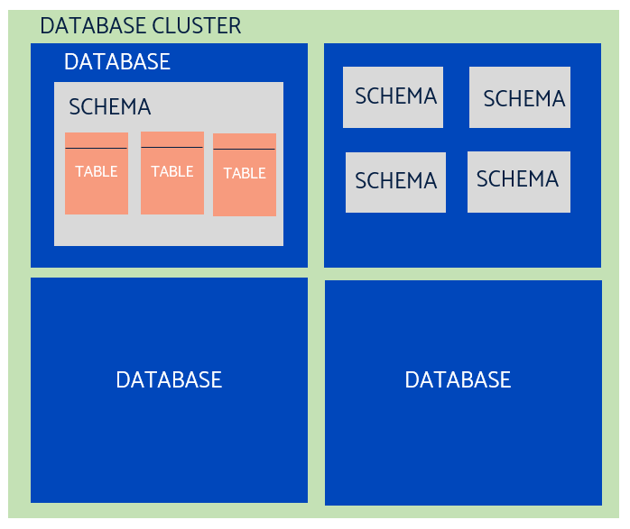
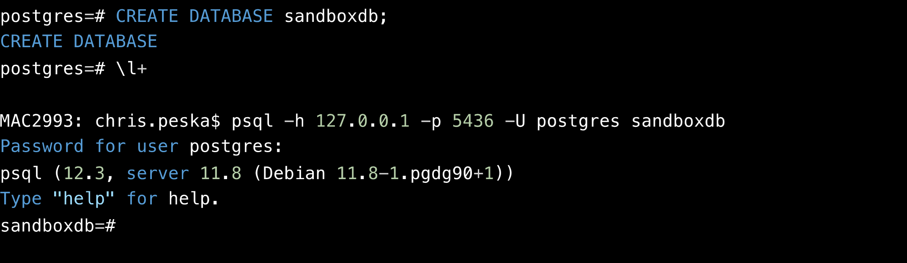
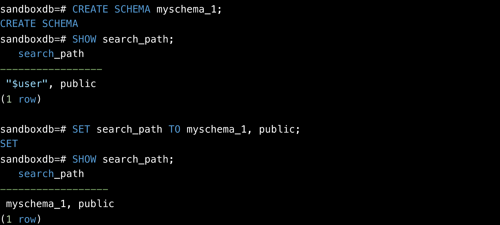
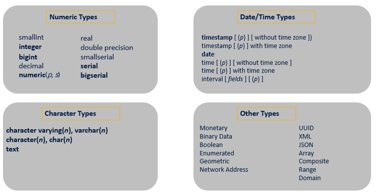
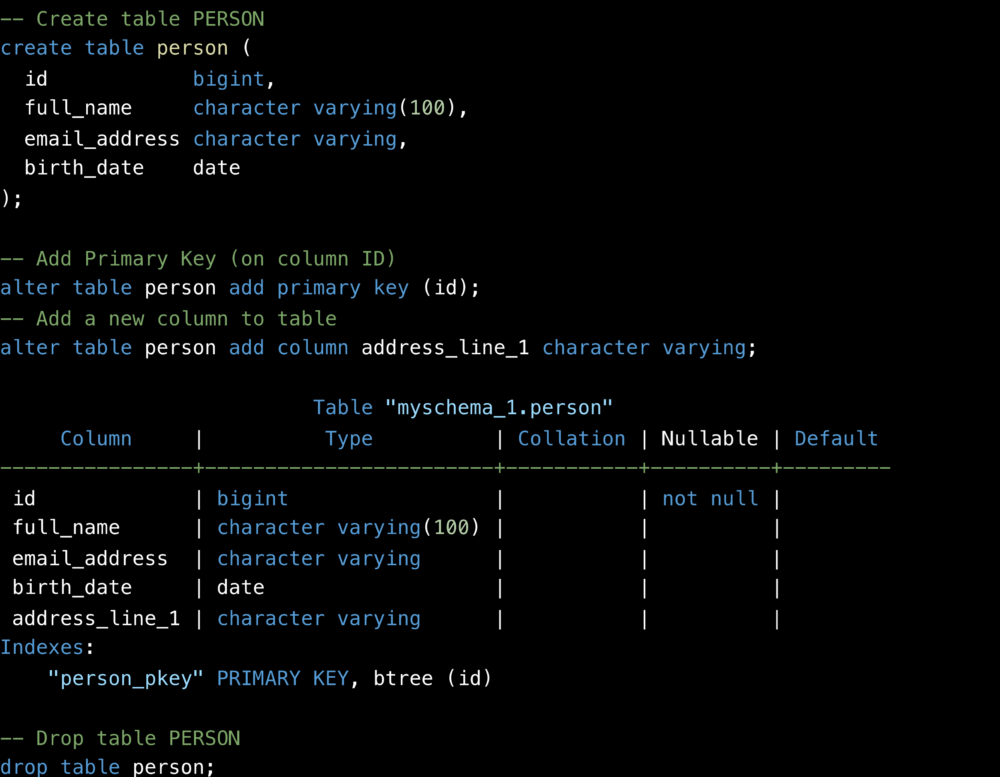
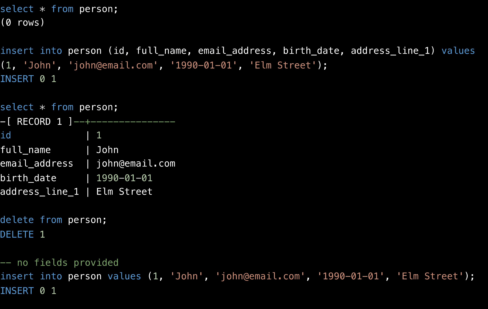

# DDL / DML 

By now you should have a basic grasp of SQL syntax for retrieving data from a database. We’re going to look at using SQL as a Data Manipulation Language and Data Definition Language.

## SQL: database objects

In SQL there are database objects. At the most simple level, you can have a cluster of databases, with each database containing multiple tables all doing different things.

The most common things, and the ones we’ll be working with today are schema and table. The others are important in SQL, but beyond the scope of the objectives for today, but we’d recommend reading further if you are interested.



* Most commonly used :
  * **SCHEMA**
  * **TABLE ( COLUMN, CONSTRAINT, KEY )**
  * SEQUENCE
  * VIEW
  * TRIGGER
  * PROCEDURE
  * FUNCTION ( UDF )
  * MATERIALIZED VIEW
  * DOMAIN / TYPE
  * INDEX
  * TABLE PARTITION
  * […]

## Create Database

In order to create a database, the PostgreSQL server must be up and running.



Before you can do anything, you must initialize a database storage area on disk. We call this a database cluster. (The SQL standard uses the term catalog cluster.) 

A database cluster is a collection of databases that is managed by a single instance of a running database server. After initialization, a database cluster will contain a database named postgres, which is meant as a default database for use by utilities, users and third party applications. 

The database server itself does not require the postgres database to exist, but many external utility programs assume it exists. Another database created within each cluster during initialization is called template1. As the name suggests, this will be used as a template for subsequently created databases; it should not be used for actual work. 


## SQL : CREATE SCHEMA

A  **schema**  is essentially a  **namespace** : it contains named objects (tables, data types, functions, and operators) whose names can duplicate those of other objects existing in other schemas. Each object is qualified :  **database.schema.object_name**



The first schema in the search path that exists is the default location for creating new objects. That is the reason that by default objects are created in the public schema. When objects are referenced in any other context without schema qualification (table modification, data modification, or query commands) the search path is traversed until a matching object is found. Therefore, in the default configuration, any unqualified access again can only refer to the public schema.

There are several reasons why one might want to use schemas:
To allow many users to use one database without interfering with each other.
To organize database objects into logical groups to make them more manageable.
Third-party applications can be put into separate schemas so they do not collide with the names of other objects.


## SQL: Data definition Language - basics


```sql
CREATE TABLE [IF NOT EXISTS] table_name (

column1 datatype(length) column_contraint,

column2 datatype(length) column_contraint,

column3 datatype(length) column_contraint,

table_constraints

);

```

column_constraint [ NOT NULL, UNIQUE, PRIMARY KEY, CHECK, FOREIGN KEY ]

**ALTER**   **TABLE**  table_name  **ACTION;**

**ACTION :**

**ADD**   **COLUMN**  column_name datatype column_constraint;

**DROP**   **COLUMN**  column_name;

**RENAME**   **COLUMN**  column_name  **TO**  new_column_name;

---

This section provides an overview of TOAST (The Oversized-Attribute Storage Technique).

## SQL: Data definition language – data types

There are many different types, just as many as you would find in a programming language. And confusingly, the types are not named the same in all databases (sigh).

However, the most common ones you will come across are numeric types – generally integer, but many others exist – and character types – basically “string” but typed in SQL as varchar or char!



## Data definition language 

Let’s look at what this means for DDL.

Here we are going to create a table named person, with 4 columns. We are then going to alter the table, to make the id column a primary key.

We can amend tables by using the alter keyword, and you can see us adding the new column address_line_1 

Now when we look at the schema defined for the table, it shows us 5 columnsm with their types, nullable values and primary keys.

We can then drop the table to delete it.




## SQL: Data Manipulation Language - basics 

A quick refresher for those who have forgotten their SQL basics!

```sql
INSERT INTO table_name(column1, column2, …) VALUES (value1, value2, …);
```

```sql
INSERT INTO table_name (column_list) VALUES (value_list_1), (value_list_2), ... (value_list_n);

```

```sql
UPDATE table_name 
SET column1 = value1, column2 = value2, ... 
WHERE condition;

```

```sql
DELETE FROM table_name WHERE condition;

```

## Data Manipulation Language

Now with DML, it’s a bit different from DDL. This is the world you will be more familiar with, as we SELECT from the person table, insert records, and delete records.



So DML is more about the data, whereas DDL is more about the structure.
