# Storing Data - Databases & SQL

This guide assumes you are comfortable with the command line, or terminal. If not, please check out our other guides first!

## Things databases give us

Databases are applications that store and retrieve data efficiently.


| **Persistence**  -	Survive power-off<br> **Security**  -	Control who sees data<br> **Queries**  -	Find data quickly<br> **Backups** - 	Recover from disaster<br> **Integrity**  -	Prevent data corruption<br> **ACID** 	-	Guarantees on data integrity | 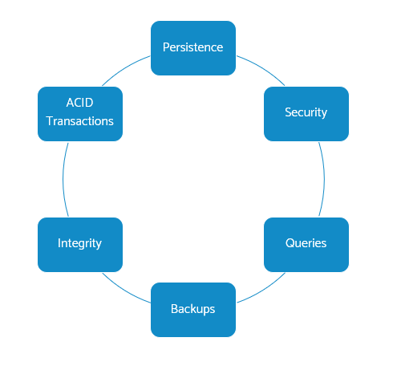 | 
| :-: | :-: | 


Sometimes you can find databases that OMIT one or more of these qualities.
It’s all about the right tool for the job at hand.

---

## What can we use them for?

For your website, a database brings you the power of  _dynamic data_
* Amazon listings
* NHS Test and Trace
* BBC News

Databases bring dynamic data - things like
* Online Shop where you can change products
* Personalised recommendations
* News site with live updates

All possible by storing data in a database

Excel spreadsheets are commonly  _abused_  as databases
* **BUT** …remember when NHS Track and Trace failed  _because_  it used Excel - where it shouldn’t have
* Different kinds of database exist – use the right tool for the job!
* That said,  _most_  website-connected DBs are relational databases

---

## Very basic basics

This is a table of facts about Students

You will have seen similar things in Excel spreadsheets

* Both have rows
* Both have columns

| name | phone | course | term |
| :-: | :-: | :-: | :-: |
| Tom Rees | 111-2222 | ENG 101 | Spring 2020 |
| Beth Hardy | 333-4444 | EEB 102 | Autumn 2020 |
| Tom Rees | 111-2222 | EEB 102 | Autumn 2020 |

1. A database is a like a whole spreadsheet file.

2. A table is a tab/sheet in the spreadsheet, with each one being given a name.

3. Data is organised into rows and columns

---

# There are many DATABASE ENGINES

There are many kinds of Database systems we can use.

* Some cost money, some are free of charge.

* Some are open source, some not

They split up into groups depending how they work with data:

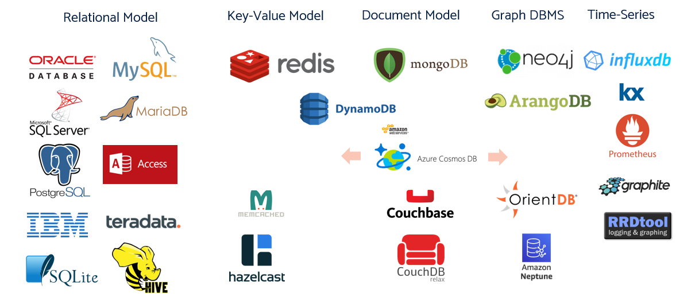


> BJSS clients often use Microsoft, Postgres, Oracle


## Types of Database

Different kinds of data are best suited to different kinds of database

Let’s look at the main types available today

### Database models : Key-Value

The simplest kind of database is a key-value store
THINK: session data for a website – just throw whatever user data we need as a “lump of data”, store against a session key.

You take your data - like your records of a Customer and their orders - and store that whole lot against a key. The key will be the Customer ID you've given that customer.

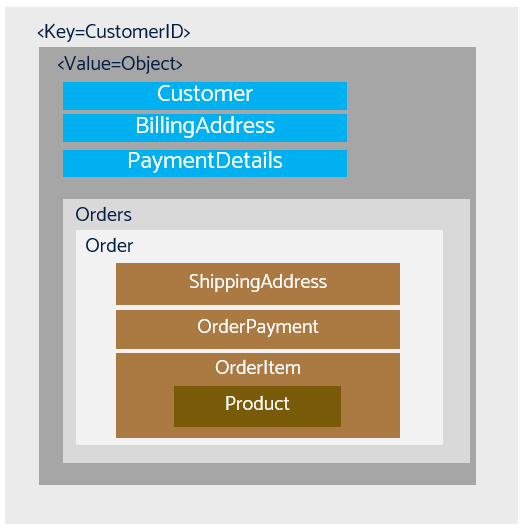

You can store data and look it up. 

To modify it, you have to fetch the whole lot of data, change it in memory, then store it all back.

These offer fast performance, as they don't do much. Example:  **Redis**

### Database models: Document

A Document database is the next step up from a key-value store.

You still store 'a lump' of data. But you don't use a key. Instead, you can query for any attribute of that data.

Store ‘whole documents’ as JSON, XML, BSON, RDF etc
  * Documents are mainly hierarchical tree data structures consisting of maps, collections, arrays, scalar values.

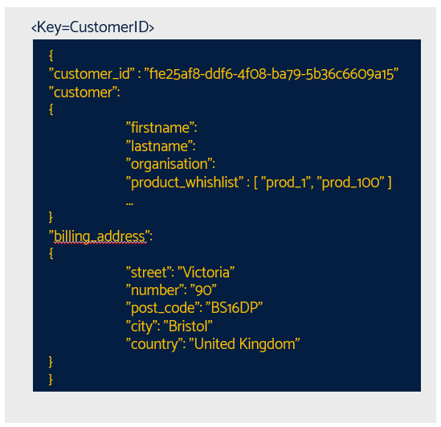

In the example above, we could return all documents where "city equals Bristol" - and we would get our document back. 

Example:  **MongoDB**


### Database models: GRaph

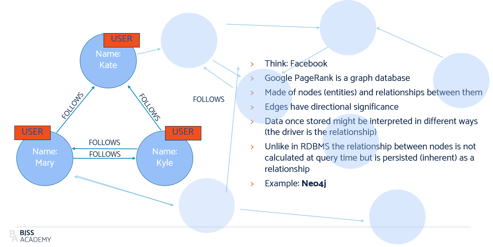

A Graph database is a different kind entirely.

It stores the mathematical idea of a graph - a bunch of nodes that can be joined together by vertices. 

The most obvious use is to store social graphs - each node has data about a single person. Each connection stores data about how those people are connected and facts relating to their relationship.

These facts inside the nodes and attached to the relationships are stored in the database.

### Database models: Time-series

A specialist kind of database is the Time Series database.

A lot of engineering data streams from sensors, and needs to capture both the data point and the time it was observed. 

Particle detectors at CERN are one example
Other good uses are server metrics, application monitoring and IoT events

These databases are good at time-based queries and aggregating time-series data

It could be : server metrics, application performance monitoring, network data, sensor data (IoT), events, clicks, TICK data – equity markets etc.

Example:  **Graphite**

| timestamp | deviceid | value |
| :-: | :-: | :-: |
| 2020-09-03 17:29:14.091219 | 1 | 90.0 |
| 2020-09-03 17:29:14.969014 | 2 | 75.0 |
| 2020-09-03 17:29:16.615036 | 3 | 81.0 |

---

### STILL RELEVANT: Relational Databases (2022)


The most widely used kind of database is the relational database, and the graph hasn't changed much over the years, the big guns are still Oracle, MySQL, Microsoft and Postgres.

## Relational Database : Building blocks

Relational databases were invented by IBM in the 1970s by Ted Codd and have been used ever since.

Every relational database has the same foundations.

Data is stored in tables, which themselves break down into rows and columns, each with a special meaning.

The easiest way to understand it is to break down an example.

### Basic table

Data is organized in Tables in a relational database.

This is an example of a database table storing student data.
The table stores data about all students.

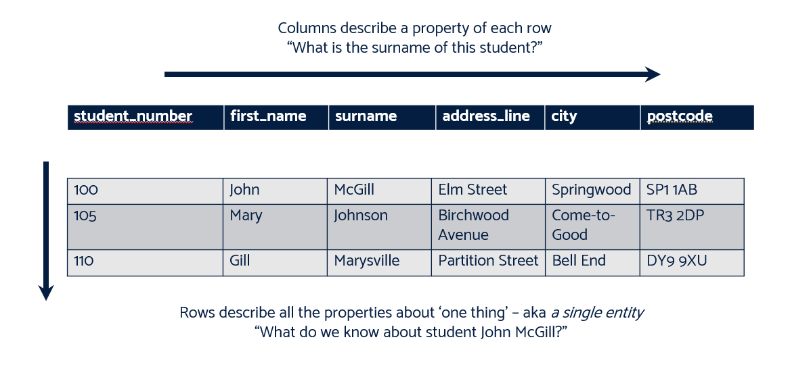

You can see the table is divided up into three rows – one row per student

Each row is divided up into columns – one column for each fact about a student

In the first row, a student called `John McGill` lives at `Elm Street` with postcode `SP1 1AB`.

Each row has an identical structure – it contains the same pieces of data about a different student.

The second row resembles the first, but holds data about `Mary Johnson` instead of `John McGill`

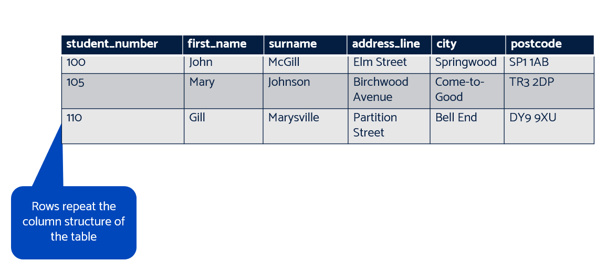

It is this regular nature that helps us fetch and process data using code.

A table can have unlimited rows, limited only by practical matters like speed and system memory.

### Column Definitions

Columns are used to add meaning to each piece of data in a row.

It has a name that explains what the data means, and a data type. You can find [more on data types here](https://www.w3schools.com/sql/sql_datatypes.asp), and we'll use some later. This data type lets our database store and search for data efficiently.

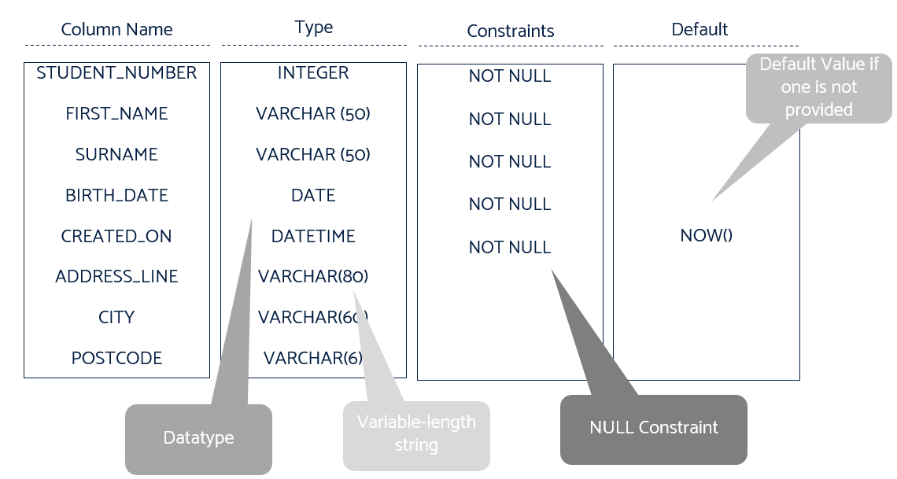

Columns can be given other attributes - sometimes known as constraints - as well:
* NOT NULL means we must supply a value
* DEFAULT is the value we should store in that column if nothing is provided

> :thought_balloon: Why is everything in UPPER CASE? No reason – it is convention from ancient days. 
Any case can be used. 

---

# SQL Basics

Right, now we know a bit about databases and tables, we need to get our hands dirty. For this we will be using PostgreSQL (or just Postgres).

First we need to install it. Fortunately other wonderful people on the internet have provided [a handy installation guide](https://www.postgresqltutorial.com/postgresql-getting-started/install-postgresql/).

> Don't forget the password you set!

Right. now that we have Postgres installed, we can to log in. Open a new Terminal and type:

```cmd
psql -U postgres
```

You will be asked for the password. Enter that and you've logged in to your postgres databse engine! You'll see the *prompt* has changed to 

```cmd
postgres=#
```

> You can see all the databases by typing `\l` to *list* the databases.

## Your first database

Okay, so far we haven't actually done much. There isn't even a database we want to use yet (remember, this is just your *view* of all the databases in your Postgres instance). So we'll want to create our own database. To do this we need to use some SQL.

SQL stands for Structured Query Language, and is the language of relational databases. It has a special syntax, or keywords, to tell it what to do. Whilst you create databases less often then tables, the syntax is very similar!

To create a database we need to use the keyword `CREATE` followed by the type of thing we want to create, in this case `DATABASE` and then the name of our database, followed by a semi-colon `;`.

Now, whilst SQL doesn't care if you type `CREATE` as `create` or `DATABASE` as `database` (it's case-insensitive for these things) it *does* care about the case for your database *name* and that you end the command with a semi-colon `;`.

Let's create our own database called `academy`:

```cmd
CREATE DATABASE academy;
```

When you press enter you should see Postgres confirm the creation by it printing `CREATE DATABASE` to the terminal:

```cmd
postgres=# CREATE DATABASE academy;
CREATE DATABASE
```

### Connecting to your database

Okay, so let's check our database has been created using the `\l` command, and that we can see `academy` listed.

Now, we can't do anything with that database yet, until we connect to it. Fortunately in Postgres that's super-simple as well using `\c <db_name>`. So for us to connect to the `academy` db, you type:

```cmd
\c academy
```

And you will see you command prompt change to:

```cmd
academy-#
```

Great! Let's now do something more exciting!!

## Create, Read, Update, Delete

There are four main things we want to be able to do with databases:

1. Create (C):

* This operation involves adding new data to the database, for example creating a new table or creating a new record in a table by inserting values into it.

2. Read (R):

* This operation involves retrieving existing data from the database. For example, you read data from a table by *querying* for certain data within it.

3. Update (U):

* This operation involves modifying existing data in the database. As an example, update an existing record in a table by changing the values of certain *columns*.

4. Delete (D):

* This operation involves removing existing data from the database. An example would be deleting records from a table based on certain conditions or delete all records from a table.

Together these are known a *CRUD* and form the basis of most operations on any persistent storage.

> Here's an example. When you first register with a website, it will *create* a record with your data. You might then *update* your address, or maybe add a *new* delivery address. In the end you might decide you no longer like their persistent advertising, and *delete* your account.

## CREATE

Tables are where your data is stored. You define tables with the `CREATE TABLE` statement, specifying column names and data types. Let's go ahead and do that:

```sql
CREATE TABLE employees (
    id SERIAL PRIMARY KEY,
    name VARCHAR(100),
    age INT,
    department VARCHAR(100)
);
```

This creates a table named `employees` with columns `id`, `name`, `age`, and `department`.

* `id SERIAL PRIMARY KEY,` this line creates the `id` column and tells the database engine that we want to use the `id` column as our `PRIMARY KEY`. For now, you can think of this as a *index* field that auto-increments every time we add a new row. So it starts at 1 the first time we insert a row, 2 the next time, and so on.

> We cover primary keys a bit later.

* `name VARCHAR(100),` this line creates the `name` column and says it contains a string of characters up to 100 characters long.

* `age INT,` this line creates the `age` column and gives it a type of integer. Only whole numbers can be stored in this field.

* `department VARCHAR(100)` finally we create the `department` column, an tell it that it will contains a string of up to 100 characters.

### INSERT INTO

Now that we have a table, it's not much use without some data in it. As part of the C in CRUD, this is about *creating* new data. Let's create some data using the `INSERT INTO` statement.

```sql
INSERT INTO employees (name, age, department) VALUES ('John Doe', 30, 'Finance');
```

Excellent. We've now got an employee named `John Doe` who is aged 30, in the IT department.

##### Wait, why didn't we insert the ID?

You may have noticed we *didn't* include the `id` field here. That's because we defined it as an auto-incrementing field when we created the table, so the database takes care of that for us when we insert data into it.

## READ

Okay, now here's the bit you mainly do a lot of, which is reading data using a *query*. For that we use the `SELECT` statement:

```sql
SELECT * FROM employees;
```

This has a special syntax using a *wildcard* - the asterisk `*`. This is special shorthand for "give me all the data from this table - all the columns and all the rows".

Hopefully this syntax makes sense - `SELECT <something> FROM <table_name>`.

### Filtering queries with WHERE

We can also *filter* data to return only data that matches certain conditions. To prove this, we need to insert a new user. Execute the following command to create another row:

```sql
INSERT INTO employees (name, age, department) VALUES ('Jane Doe', 31, 'IT');
```

Now we can query our data again using the `SELECT * FROM employees;`, which will show you two rows.

To get only ONE of those rows back, we can add filters, using a `WHERE` clause:

```sql
SELECT * FROM employees WHERE department = 'IT';
```

This command will return one row from the table, that of Jane Doe, as that's the only employee whose department matches the WHERE clause.

Again, this syntax should be fairly readable as `SELECT <everything> FROM <table_name> WHERE <column_name> = <value>`

> TASK: Can you select all data from the table where the age is less than 31?
>
> you can use `<` `<=` `>=` `>` and `=` in SQL WHERE clauses!

### Filtering for certain columns

If we only want certain data back from our table, such as the employee name, we can specify the column name (or names) we want. This is very useful when you're only interested in a few columns data, as tables can be very large!

```sql
SELECT name FROM employees WHERE department = 'IT';

SELECT name, age FROM employees WHERE department = 'IT';
```

## UPDATE

When we want to change existing data, we use the `UPDATE` keyword:

```sql
UPDATE employees SET age = 31 WHERE name = 'John Doe';
```

You'll notice we use a `WHERE` clause here. That's because we only want to update a single user. If you don't add a `WHERE` clause to your `UPDATE` statement, then it will update *all* the rows in the database!

NOTE: You wouldn't normally do this by the user name, as in large companies there are often people with the same name and it would update both employees! Instead you'd use the *primary key*:

```sql
UPDATE employees SET age = 31 WHERE id = 1;
```

You can also update multiple fields at once:

```sql
UPDATE employees SET age = 31, name = 'New Name' WHERE id = 1;
```

## DELETE

Unsurprisingly, you delete users using the `DELETE` keyword:

```sql
DELETE FROM employees WHERE id = 1;
```

Again, hopefully the syntax makes sense here, basic SQL is pretty straightforward!

If you want to delete everything from a table:

```sql
DELETE FROM employees;
```

## UPDATE Part 2 - altering our table structure

As part of the Update bit of CRUD, we'll often want to be able to alter our tables, by adding new columns, or removing ones we no longer need.

### Add a column

Let's assume we forgot to add an `email` column:

```sql
ALTER TABLE employees ADD COLUMN email VARCHAR(100);
```

Using the `ALTER` keyword, we say we want to alter a `TABLE`, then give it the name of the table (employees).

Then we tell it the *type* of alteration we want, in this case we want to add a column so we use `ADD COLUMN`, give it the name of the column we want to add (email), and finally its data type `VARCHAR(100)`.

### Modify a column

We can also modify a column (and add constraints like NOT NULL, but we won't be covering that here).

Maybe we found out that emails can be longer than 100 characters, and up to 255. We'd alter our existing column like so:

```sql
ALTER TABLE employees ALTER COLUMN email TYPE VARCHAR(255);
```

### Remove a column

Finally, we realise that we don't even need the email column! In SQL when we want to remove something entirely, we use the `DROP` keyword:

```sql
ALTER TABLE employees DROP COLUMN email;
```

## Exercises

1. Create a new table named `addresses`, with the columns `id` are primary key, `address_line_1`, `address_line_2`, `town`, and `postcode`, with the right VARCHAR length you choose.

2. Add three new, unique addresses to the table:

| address_line_1 | address_line_2 | town      | postcode  |
|----------------|----------------|-----------|-----------|
| 123 Main St    | Apt 101        | Anytown   | KL12 3CD  |
| 456 Elm St     | Door 6         | Newtown   | XY45 6EF  |
| 789 Oak St     | Suite 202      | Othertown | KL78 9GH  |


3. Add a new column `county` to the table.

4. Update all the addresses to be in the *same* county.

5. Delete any addresses where the postcode *starts* with "KL" using `LIKE`: https://www.w3schools.com/sql/sql_like.asp

---

# Relationships between tables

The power of relational databases comes from *relationships* between tables.

We can split up our data into separate tables, each one describing some kind of group of data. For instance, we have created above two tables, one of which contains employee name, age, and department, and addresses, but they are not connected, or joined, to each other. Currently the data is *unrelated* between tables.

We want to be able to relate the *employees* to an *address*.

Definitions:

* **Relation**  - set of tuples, called a Table

* **Relationship**  - associations between tables created using join statements to retrieve data

Using more than one table allows us to change avoid duplication in our data – so we only ever have one copy of any fact

Let’s use the examples of Students we used in the first part – this time we will split out Addresses into its own table.

## Kinds of Relationship

There are different ways we can relate data in one table to another:

* One to One - there is exactly one match in another table related to this 

Example, you might only have one department you belong to

* One to Many - there are many matches in another table to this  

Example, you might have many addresses you want things to be delivered to

* Many to Many - there are many matches to each other in both tables

Example, there are multiple students on a course, and a course has multiple students

## Relationship – One-To-one

Let’s take our previous Student table and split it in two.
Put name and date of birth details in the Student table
Split out address details into a new Address table

To link where a student lives to their name, we need a relationship between these tables

We can use a simple one-to-one relation. Every student has exactly one address.

To do that we need two new things:
1. An *id* column in the address table which uniquely identifies an address
2. A new column in the Students table which holds the *address_id* of the address they live at

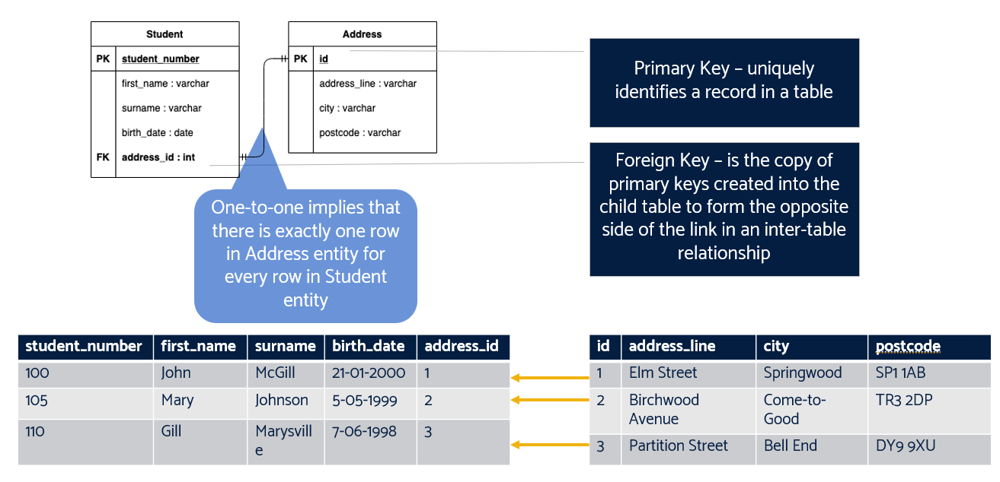

Can you see how that works?
`John McGill` lives at *address_id* `1`. We can look that up in the Address table and find the details of `Elm Street, SP1 1AB`

This is called a JOIN across tables.

The `id` is called a *PRIMARY KEY* for rows in the Address table. It must uniquely identify each row.

The `address_id` column in the Student table is called a *FOREIGN KEY*

A FOREIGN KEY is simply something that can be found as a Primary Key in another table

We can now use this in our SQL to *join* the tables and get the students data with all their associated address information:

```sql
SELECT *
FROM students
LEFT JOIN addresses ON students.address_id = addresses.id;
```

A `LEFT JOIN` returns all rows from the left table (the table specified before the JOIN keyword) and the matched rows from the right table (the table specified after the JOIN keyword). If there is no match found in the right table, NULL values are returned for the columns of the right table.

> :thought_balloon: FOREIGN KEY-PRIMARY KEY pairs are how all relations are constructed

## Exercises

1. Create a new database called `university`. (To exit your current connection if you are still in the academy db, use `\c postgres` first).

2. Create the students and address tables as specified above.

3. Create the JOIN to return all students and their address.

## QUIZ : One-to-one

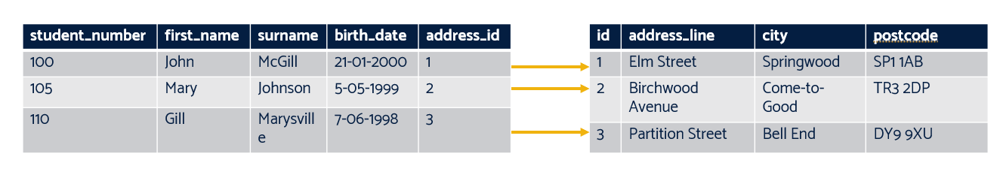

If things go well and Mary Johnson moves in to live with John McGill, what change would we need to make to the Student table?

## Answer

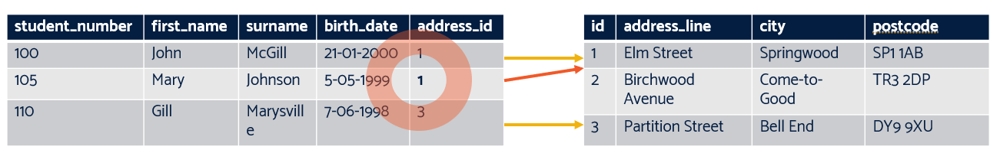

[A: student_number 105 address_id changes to 2 from 1]

## How could we solve this?

> * We have many students
> * We have many seminars
> * Each student attends many seminars
> * Each seminar has many students

> How do we store which seminars a student is enrolled on?
>  * Hint:  **one**  column can only have  **one**  value in  **one**  row

So here we have a common problem, complex data relationships.

We have many students who may attend many seminars, but we also need to know how many students there are at each seminar. How do we store this?

Answers coming up!

---

## RELATIONSHIPS : One-To-Many / Many-To-Many

More complex data needs more complex relationships.

This is how we can model Students that enrol on Seminars.
One student can attend many seminars – and each seminar will have many students.

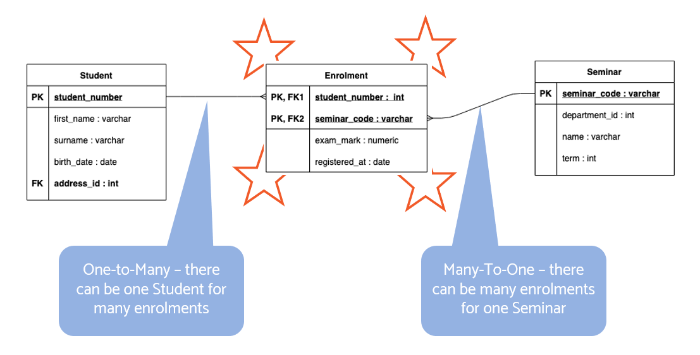

This is a classis MANY-TO-MANY relationship.
We do it by breaking it down into a ONE-TO-MANY and a MANY-TO-ONE relationship.

Look at Student-Enrolment. That’s a ONE-TO-MANY. It needs:
* StudentID in the student table to identify each student
* Student_number foreign key IN THE ENROLMENT table

This is different to one-to-one; it is “backwards”. We can have many rows in the Enrolment table all linking back to the same student:

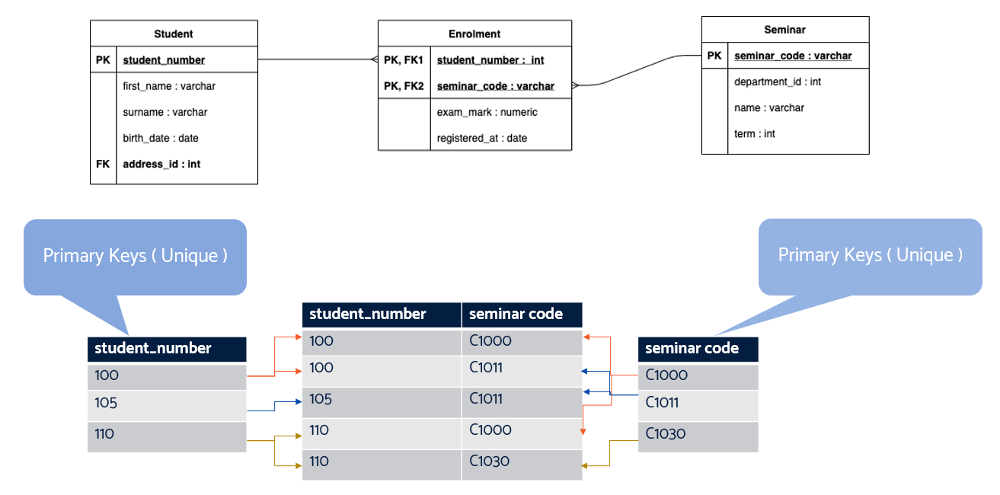

The Enrolment table is called a LINK TABLE as it links together the Student and Seminar tables.
Have a look at the bottom half of this diagram. It shows actual rows.

Look at the top row of the Enrolment tables. It says that student 100 is on seminar C1000

If you look at the fourth row down, you can see that another student is on seminar C1000. This time student 110.

Seminar C1000 has students 100 and 110 on it.

You can also find out that :
* Seminar C1030 has student 110 on it
* Student 100 has enrolled for two seminars, C1000 and C1011

Naming the link table is REALLY HARD – You need a NOUN that describes what the relationship is. Good luck!

Relationships allow us to run QUERIES on our data like this. That’s powerful.

## RELATIONSHIPS : KEYS

A little more on keys. Every relationship is simply a reference to a PRIMARY KEY in some table. It’s that simple.

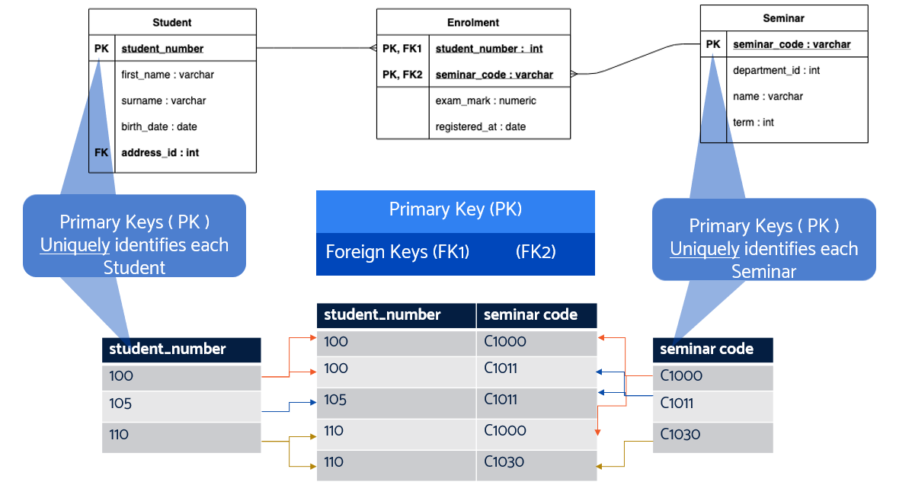

PRIMARY KEYS uniquely identify a row in a table, which means they uniquely identify some “thing” in the real world.

FOREIGN KEYS tell us how to link two tables together. If a row has a foreign key to some other table, we can JOIN.

## What happens when we delete rows?

Those tables might refer to rows that don’t exist anymore

What should we do?

## RELATIONSHIPS : Referential integrity

Here’s a question:
*What happens when we delete a row that some other table is linking to?*

A: We can no longer look up the linked data

We have broken *REFERENTIAL INTEGRITY* – the name given to making sure all our links work

There are 5 main ways to deal with that:
1. HIDDEN FLAG – use an extra column to say “do not include this row in results”
2. CASCADE DELETE – When we delete a row, delete rows in other tables that link to it
3. DO NOTHING – this can lead to a PHANTOM ROW which is unreachable from any other data
4. SET NULL – set the foreign key to NULL to indicate we don’t have anything to link to
5. SET DEFAULT – use a default value, if that makes sense -  eg a Head Office Telephone number, if we delete a local phone number

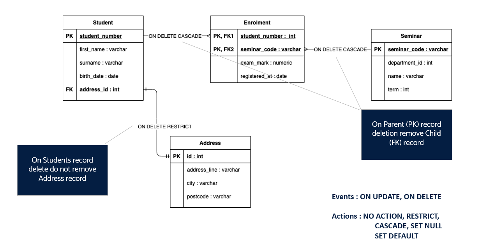

## Example - Airbnb

Finally for this section, here’s an example of how powerful these techniques can be.

These are the tables, columns and relationships you would need to build an AirBnB clone.


It features around bookings, which are between hosts and users.
A booking has a Place in some City, in a Country.

Each booking can have one-to-many Reviews attached to it.

That’s all modelled here in this ENTITY RELATION DIAGRAM or *ERD*.

Powerful, isn’t it?

# DDL / DML 

By now you should have a basic grasp of SQL syntax for retrieving data from a database. We’re going to look at using SQL as a Data Manipulation Language and Data Definition Language.

## SQL: database objects

In SQL there are database objects. At the most simple level, you can have a cluster of databases, with each database containing multiple tables all doing different things.

The most common things, and the ones we’ll be working with today are schema and table. The others are important in SQL, but beyond the scope of the objectives for today, but we’d recommend reading further if you are interested.


* Most commonly used :
  * **SCHEMA**
  * **TABLE ( COLUMN, CONSTRAINT, KEY )**
  * SEQUENCE
  * VIEW
  * TRIGGER
  * PROCEDURE
  * FUNCTION ( UDF )
  * MATERIALIZED VIEW
  * DOMAIN / TYPE
  * INDEX
  * TABLE PARTITION
  * […]

## Create Database

In order to create a database, the PostgreSQL server must be up and running.


Before you can do anything, you must initialize a database storage area on disk. We call this a database cluster. (The SQL standard uses the term catalog cluster.) 

A database cluster is a collection of databases that is managed by a single instance of a running database server. After initialization, a database cluster will contain a database named postgres, which is meant as a default database for use by utilities, users and third party applications. 

The database server itself does not require the postgres database to exist, but many external utility programs assume it exists. Another database created within each cluster during initialization is called template1. As the name suggests, this will be used as a template for subsequently created databases; it should not be used for actual work. 


## SQL : CREATE SCHEMA

A  **schema**  is essentially a  **namespace** : it contains named objects (tables, data types, functions, and operators) whose names can duplicate those of other objects existing in other schemas. Each object is qualified :  **database.schema.object_name**


The first schema in the search path that exists is the default location for creating new objects. That is the reason that by default objects are created in the public schema. When objects are referenced in any other context without schema qualification (table modification, data modification, or query commands) the search path is traversed until a matching object is found. Therefore, in the default configuration, any unqualified access again can only refer to the public schema.

There are several reasons why one might want to use schemas:
To allow many users to use one database without interfering with each other.
To organize database objects into logical groups to make them more manageable.
Third-party applications can be put into separate schemas so they do not collide with the names of other objects.


## SQL: Data definition Language - basics


```sql
CREATE TABLE [IF NOT EXISTS] table_name (

column1 datatype(length) column_contraint,

column2 datatype(length) column_contraint,

column3 datatype(length) column_contraint,

table_constraints

);

```

column_constraint [ NOT NULL, UNIQUE, PRIMARY KEY, CHECK, FOREIGN KEY ]

**ALTER**   **TABLE**  table_name  **ACTION;**

**ACTION :**

**ADD**   **COLUMN**  column_name datatype column_constraint;

**DROP**   **COLUMN**  column_name;

**RENAME**   **COLUMN**  column_name  **TO**  new_column_name;

---

This section provides an overview of TOAST (The Oversized-Attribute Storage Technique).

## SQL: Data definition language – data types

There are many different types, just as many as you would find in a programming language. And confusingly, the types are not named the same in all databases (sigh).

However, the most common ones you will come across are numeric types – generally integer, but many others exist – and character types – basically “string” but typed in SQL as varchar or char!


## Data definition language 

Let’s look at what this means for DDL.

Here we are going to create a table named person, with 4 columns. We are then going to alter the table, to make the id column a primary key.

We can amend tables by using the alter keyword, and you can see us adding the new column address_line_1 

Now when we look at the schema defined for the table, it shows us 5 columnsm with their types, nullable values and primary keys.

We can then drop the table to delete it.


## SQL: Data Manipulation Language - basics 

A quick refresher for those who have forgotten their SQL basics!

```sql
INSERT INTO table_name(column1, column2, …) VALUES (value1, value2, …);
```

```sql
INSERT INTO table_name (column_list) VALUES (value_list_1), (value_list_2), ... (value_list_n);

```

```sql
UPDATE table_name 
SET column1 = value1, column2 = value2, ... 
WHERE condition;

```

```sql
DELETE FROM table_name WHERE condition;

```

## Data Manipulation Language

Now with DML, it’s a bit different from DDL. This is the world you will be more familiar with, as we SELECT from the person table, insert records, and delete records.


So DML is more about the data, whereas DDL is more about the structure.
